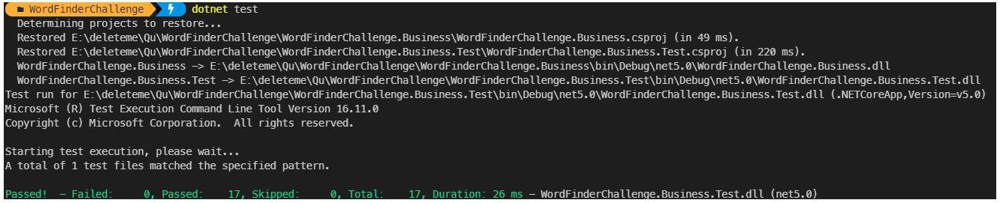
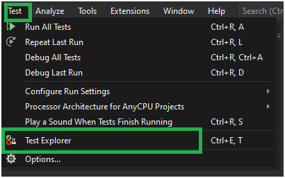
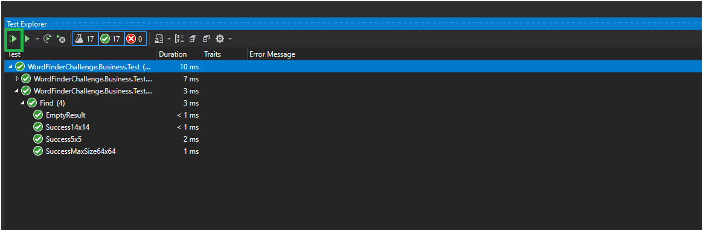
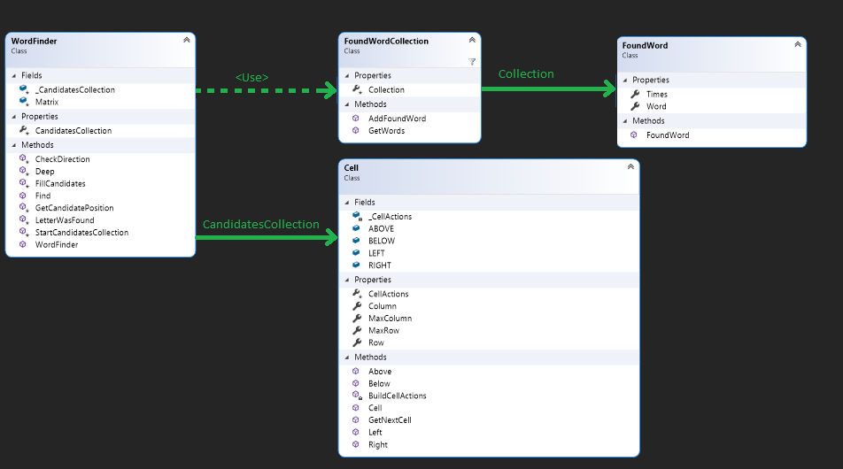

- [Fast summary:](#fast-summary)
  - [How can I run this project?:](#how-can-i-run-this-project)
  - [What is the Time complexity:](#what-is-the-time-complexity)
- [Challenge to solve](#challenge-to-solve)
- [The algorithm](#the-algorithm)
  - [Step 1 understanding:](#step-1-understanding)
  - [Step 2 Thinking an algorithm to "see":](#step-2-thinking-an-algorithm-to-see)
  - [Important Notes:](#important-notes)
    - [The chill example:](#the-chill-example)
  - [Step 3 How found next letters:](#step-3-how-found-next-letters)
  - [The output:](#the-output)
    - [With chilli example:](#with-chilli-example)
- [The classes](#the-classes)
  - [Cell class:](#cell-class)
  - [FoundWord:](#foundword)
  - [FoundWordCollection:](#foundwordcollection)
- [For testing](#for-testing)

# Fast summary:

- [x] dotnet 5
- [x] xunit tests
- [x] Unit tests

## How can I run this project?:

You can run "dotnet run" as you can see in the follow image:

From visual studio 2019 you choose Test Explorer from menu Test as you can se in the follow image:

After hit the run all test button as you can see in the next imagen:

## What is the Time complexity:

In summary, **preprocesing: O(n^2)** only once by matrix.

**Find method: O(w*c)**

Where w = len(word) and c = canditates inside matrix.

# Challenge to solve

Presented with a character matrix and a large stream of words, your task is to create a Class
that searches the matrix to look for the words from the word stream. Words may appear
horizontally, from left to right, or vertically, from top to bottom. In the example below, the word
stream has four words and the matrix contains only three of those words ("chill", "cold" and"wind")

|  |  |  |  |  |
|---|---|---|---|---|
| a | b | c | d | ***c*** |
| f | g | ***w*** | i | ***o*** |
| ***c*** | ***h*** | ***i*** | ***l*** | ***l*** |
| p | q | ***n*** | s | ***d*** |
| u | v | ***d*** | x | y |

The WordFinder constructor receives a set of strings which represents a character matrix. The
**matrix size does not exceed 64x64**, all strings contain the same number of characters. The
"Find" method should **return the top 10 most repeated words** from the word stream found in the
matrix. If no words are found, the "Find" method should return an empty set of strings. If any
word in the word stream is found more than once within the stream, the search results
should count it only once. 

# The algorithm

## Step 1 understanding:

After solving a couple of matrix I notice that my approach contained the follow steps:

* Find the first letter from my current word inside the matrix
* When I found the first letter the matrix:
  * I checked if the next letter in my word was inside the matrix through 4 directions (up,down,right and left)
* When some letters were not found I ignored the current word and tried finding the next word in the list.

Here, most important was that I started my search from  the first letter inside the matrix, so here my main question was ¿
can I apply this algorithm in my code?

## Step 2 Thinking an algorithm to "see":

I noticed that I needed "see" the letter position inside the matrix, so my approach applied the following preprocessing task :

* When I read the matrix I can create a list with 26 positions and in each position I can store, all points (row, column) where this letter appears inside the matrix.

## Important Notes:
* Complexity order for this **preprocessing algorithm is O(m*n)** where n: rows and n = columns.
* The ain advantage, after applying preprocessing algorithm I can **get all positions for any letter with time complexity  O(1)**.

Here, the max quantity of operations for preprocessing step will be 4096 (64*64).

In this case as said Halim, Steven and Felix Halim. *"Competitive Programming 3 The New Lower Bound of Programming Contest"*, 2013.

***"Modern computers are quite fast and can process up to ≈ 100M (or 10^8; 1M = 1, 000, 000) operations in a few seconds"***

In conclusion reprocessing algorithm should be executed less than 1 second :bowtie: :smiley:
**

### The chill example:

Applying the above preprocessing for next matrix:

|  |  |  |  |  |
|---|---|---|---|---|
| a | b | c | d | c |
| f | g | w | i | o |
| c | h | i | l | l |
| p | q | n | s | d |
| u | v | d | x | y |

I will have the following list of letters and positions:

a: (0,0) 
b: (0,1) 
c: (0,2),(0,4),(2,0) 
. 
. 
. 
y: (4,4)

From here, looking for the word ***chill*** I can start Checking all positions in the original matrix where letter **c** appears.

**c**hill

c: (0,2),(0,4),(2,0) 

As we can see, the third point (2,0) is linked to the whole word, so preprocessing helps us to "see."

|  |  |  |  |  |
|---|---|---|---|---|
| a | b | **c** | d | **c** |
| f | g | w | i | o |
| ***c*** | ***h*** | ***i*** | ***l*** | ***l*** |
| p | q | n | s | d |
| u | v | d | x | y |

## Step 3 How found next letters:

Once we found the first letter inside the matrix, and all positions where this letter appears,
each position becomes in a candidate for the complete word, so each point we will execute the next process:

* While we found the subsequent letter we visit the next position
  * If some letter was not found, check another direction starting from candidate point.
  * If all letters were found 1 to total times that this word appears.

Here, the time complexity to look for any word is:

* O(4*len(word)*len(candidates))

Simplifying:

w = len(w)
c = len(candidates)

**Time complexity: O(w*c)**

## The output:

Here the sentence *"return the top 10 most repeated words"* is important because, this means that we should  pay attention to some kind of sorting criteria (repetition). 

As concecuence, Iwill use a sorting algorithm to put all words in decreasing order and return
only the first 10 words, so in this case the time complexity can be evaluated as follow:

* O(sort(len(foundCollection)+10)) => O(sort(len(fundCollection))) 

Here, I used the [sort algorithm from c# ]((https://docs.microsoft.com/en-us/dotnet/api/system.collections.generic.list-1.sort?view=net-5.0)), so the final order will be: 

* O(len(found_collection)*log2(len(found_collection)))

Simplifying: 

n = len(found_collection)

**Time complexity = O(nlogn)**

### With chilli example:

  |  |  |  |  |  |
|---|---|---|---|---|
| a | b | **c** | d | **c** |
| f | g | w | i | o |
| ***c*** | ***h*** | ***i*** | ***l*** | ***l*** |
| p | q | n | s | d |
| u | v | d | x | y |

c: (0,2),(0,4),(2,0) 

Candidates: 

The first candidate: (0,2)=> any direction contains chill word
The second candidate: (0,4)=> any direction contains chill word
The third candidate: (0,2)=> word is found from left to right 

Here, will be possible to detect that the word "chili" appears 1 times inside the matrix, in addition,  as each candidate is checked will be possible answer to the question  

¿how many times appear the word "chili" inside the matrix?

# The classes

## Cell class:

This class allows a Single Responsability principle mainly contains important
data as row, column for current cell and max row and max column for all matrices.

 

Object with Cell type can give us the next cell forward keeping an eye in matrix limits.

## FoundWord:

This classe allows store each found word and how many times appear inside the original matrix.

## FoundWordCollection:

Contains a FoundWord list and allows sort and slice the total found word list to return a maximum quantity
of words in decreasing order using the times that each word appears as property to compare).

# For testing

Next cases were identified to improve the algorithm behavior: 

* Wordstream contains several words more than once time,
 here I will apply a set to keep only unique words before starting the looking for process.

* Current cell is a border cell (next position doesn't exist)

* Any word was found

* Some words appear inside matrix more than once.